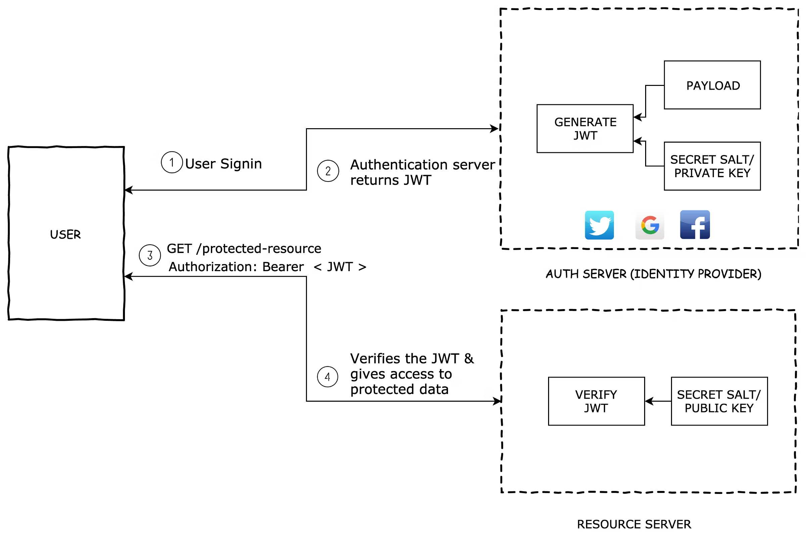
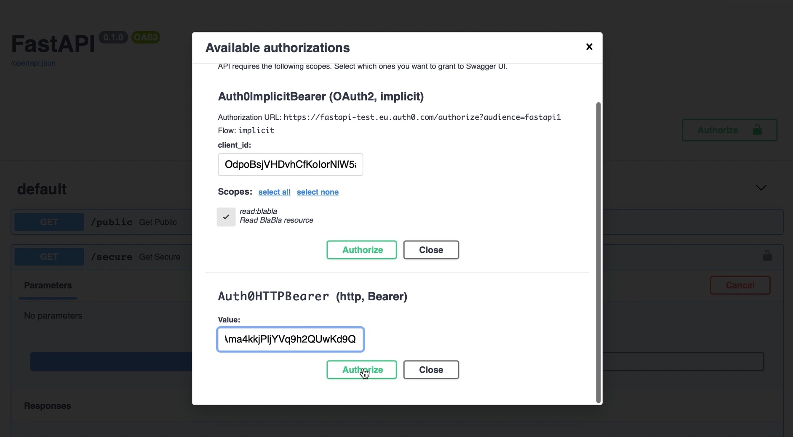

# Microservice Overview and Instructions

A microservices architecture offers several advantages over a monolithic application. With microservices the overall application is broken up into distinct services. This design allows for:
- Scaling of each microservice differently, such as search, payments, data science, etc.
- Separation of concerns
- Each team can work independently on their domain
- Mix of technologies - e.g., each service can be independently composed of Django, Flask, FastApi, Falcon, Javascript/Node etc.


# Microservices Architecture

Central to a microservices architecture is the authentication layer, which is needed for authentication, authorization, and provides overall identity access management.

Users are authenticated by tokens issued by the authentication layer. When a user logs in, the auth layer generates a signed token and returns it to the client. 



For every service that the client seeks to access, each microservice verifies the signature of the JWT token by using the same secret provided to sign the token. This verification is automatically done by Auth0, such that the secret key does not have to be distributed to every service.  


# Install and Usage
## Install
To run the auth0 framework, make sure you have `python3` and `pip` installed.

Rename `.env.example` to `.env` and populate it with the client ID, domain, secret, callback URL and audience for your Auth0 app. 

Once those variables are set, run 

`pip install -r requirements.txt` to install the dependencies and run `python3 application/main.py`.

The app will be served at [http://localhost:6060/](http://localhost:6060/).


## Requirements
 - Grant types
 - Permissions and scopes

### Email field requirements
In order to get email for Auth0User, the API must have "openid profile email" permission and the rule "Add email to access token" must be added with the matching namespace, see [tests](tests/README.md).
The security is not affected in any way if we don't do this, but we need to if we want to know the user email's address. Otherwise, email field will always be `None`.

### Swagger UI login requirements
In order to utilize the interactive docs for the implicit flow, the callback url must be registered on the auth0 dashboard. For swagger this url is `{SWAGGER_DOCS_URL}/oauth2-redirect`, so if you are running FastAPI on localhost:8000, that becomes `http://localhost:8000/docs/oauth2-redirect`. Add it to "Allowed Callback URLs" for the application which you intend to login with (the client_id you input for Auth0ImplicitBearer authorization).

In order to logout and login with another user, it's necessary to manually call GET `https://{auth0_domain}/v2/logout`, becacause the Swagger UI logout button is not able to clear 3rd party session / cookies.

## Example usage
```Python
from fastapi import FastAPI, Depends, Security
from fastapi_auth0 import Auth0, Auth0User

auth = Auth0(domain='your-tenant.auth0.com', api_audience='your-api-identifier', scopes={'read:blabla': ''})
app = FastAPI()

@app.get("/public")
def get_public():
    return {"message": "Anonymous user"}

@app.get("/secure", dependencies=[Depends(auth.implicit_scheme)])
def get_secure(user: Auth0User = Security(auth.get_user, scopes=['read:blabla'])):
    return {"message": f"{user}"}
```



Example user responses:
```Python
id='Art2l2uCeCQk5zDVbZzNZmQkLJXLd9Uy@clients' permissions=['read:blabla'] email=None               # user is M2M app
id='auth0|5fe72b8eb2ac50006f725451' permissions=['read:blabla'] email='some.user@outlook.com'      # user signed up using auth0 database
id='google-oauth2|115595596713285791346' permissions=['read:blabla'] email='other.user@gmail.com'  # user signed up using google
```

## What is Auth0?

Auth0 helps you to:

* Add authentication with [multiple authentication sources](https://auth0.com/docs/identityproviders),
either social like **Google, Facebook, Microsoft Account, LinkedIn, GitHub, Twitter, Box, Salesforce, among others**,or
enterprise identity systems like **Windows Azure AD, Google Apps, Active Directory, ADFS or any SAML Identity Provider**.
* Add support for **[linking different user accounts](https://auth0.com/docs/link-accounts)** with the same user.
* Support for generating signed [JSON Web Tokens](https://auth0.com/docs/jwt) to call your APIs and
**flow the user identity** securely.
* Analytics of how, when and where users are logging in.
* Pull data from other sources and add it to the user profile, through [JavaScript rules](https://auth0.com/docs/rules).


